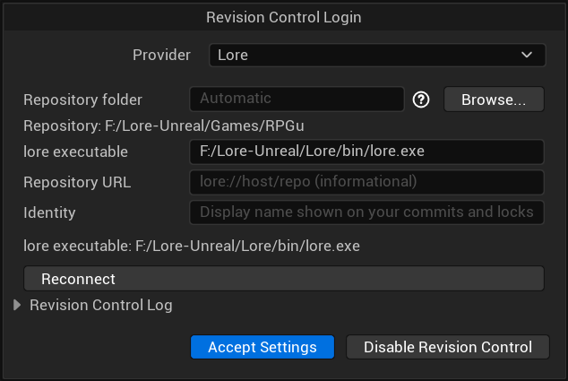

# Lore Source Control for Unreal Engine

**Native [Lore](https://github.com/EpicGames/lore) revision control inside the Unreal Editor.**

This plugin adds Lore as a source control provider in Unreal Engine, alongside the
engine's built-in Perforce, Git, and Subversion providers. It drives the public
`lore` command-line interface as a child process, so there is no native library to
build or link.

> **Note**
> This plugin is pre-1.0 and tracks Lore while Lore itself is pre-1.0. Behavior and
> on-disk formats may change between releases.

## Supported Engine Versions

| Unreal Engine | Status |
| --- | --- |
| 5.5 | Supported |
| 5.6 | Supported |
| 5.7 | Supported (primary development target) |
| 5.8 | Supported |

## Requirements

- Unreal Engine 5.5, 5.6, 5.7, or 5.8
- The [`lore` CLI](https://github.com/EpicGames/lore) installed and on your `PATH`
  (or point the plugin at it in settings)
- An existing Lore working copy for your project (run `lore` once to initialize or
  sync a repository in your project directory)

## Install

1. Copy or unzip the `LoreSourceControl` folder into your project's `Plugins` directory:

```text
<YourProject>/Plugins/LoreSourceControl/
```

2. Regenerate project files and build the Editor target.
3. Launch the editor, open **Revision Control > Change Source Control Settings**,
   and choose **Lore** as the provider.

### Automatic path detection

The plugin tries to locate **two separate things**: the Lore CLI executable and
the Lore working-copy root. These can be in different folders; you do not need to
install the CLI beside the Unreal project.

#### Lore executable (file)

The plugin checks, in order:

1. The **lore executable** setting, if it names an existing file.
2. `lore.exe` (Windows) or `lore` (other platforms) on the editor process's `PATH`.
3. A binary, if supplied, at
   `<Plugin>/Binaries/ThirdParty/Lore/<Platform>/lore.exe` (or `lore`), where
   `<Platform>` is Unreal's binaries subdirectory, such as `Win64`.

Leave the field empty to use discovery, or enter the **full executable filename**,
not its containing folder. An override that does not exist falls through to the
other locations. Discovery does not scan arbitrary drives or download Lore.
The settings panel displays the resolved executable; initial automatic detection
also populates the setting. Clear an old value to discover a new location.
After changing the setting, reconnect. If you changed `PATH`, restart Unreal
(and its launcher if necessary) so the editor inherits the new environment.

#### Repository folder (working-copy root)

Hover the **?** icon beside the field for setup instructions.

Leave **Repository folder** empty to search the project folder and up to **four
parent folders** for a `.lore` directory. The nearest match wins. For example,
`MyRepo/MyGame/MyGame.uproject` automatically uses `MyRepo` when
`MyRepo/.lore` exists. The settings panel displays the resolved repository folder.

For deeper layouts, enter an absolute path or click **Browse...** to choose the
folder **containing** `.lore`. The native picker selects folders, not files:
`.lore` is a metadata directory, not a file extension. If you select `.lore`
itself, Browse uses its parent. Invalid selections display an inline error and
leave the previous setting unchanged; Cancel also leaves it unchanged.
When typing a path, use the parent of `.lore`, not `.lore` itself, a `.uproject` file, or
a remote URL. The selected folder must contain the Unreal project. Invalid overrides show an
error and do not fall back to automatic discovery. Click **Reconnect** after
changing the field; wait for any current Lore operation to finish first.

The override is stored only in this project's
`Saved/Config/LoreRepositorySettings.ini`, even when Unreal uses global source
control settings. Clear it to restore automatic discovery. Lore command paths
are relative to the repository root, including the project's subdirectory.



## Overview

- **Status overlays** — modified, added, deleted, and locked assets are surfaced in
  the Content Browser, including files changed locally without an explicit checkout.
- **Check out / check in** — acquire and release Lore locks, then stage, commit, and
  push from the editor's submit dialog.
- **Sync and history** — pull the latest revisions and view per-file history and
  diffs against the head revision.
- **Lock awareness** — files locked by other users are shown and protected from
  accidental submission.
- **Fail-closed submits** — check-in re-verifies lock ownership and head state before
  it mutates anything.

## Checking for updates vs. syncing

With Lore CLI `0.9.0+783`, there is no separate `lore fetch` command. To inspect
remote revisions without updating your working files, run from the working copy:

```sh
lore --remote history 10
```

To check local edits and then update the working copy:

```sh
lore status --scan
lore sync
```

The editor's **Sync** operation runs `lore sync`: it updates the working copy,
not just remote metadata, and currently operates on the repository as a whole
even when invoked from selected assets. Save editor changes first and review
local edits before syncing. Do not use `sync --reset` to merely check for updates;
that option resets locally modified files to match the incoming revision.
**Check in** stages and commits selected files, then runs `lore push`.

## Identity vs. authentication

The **Identity** field in the Lore settings panel is **not a login**. It is a display
label (passed to `lore --identity`) that is attributed to your commits and locks so
teammates can see who did what. It has no password and grants no access.

Server **authentication** — when a Lore server requires it — is handled entirely by
the `lore` CLI itself (for example via `lore login` or the server's configured
credential flow), not by this plugin. The plugin never stores or transmits passwords.

## How it works

Every operation maps to a `lore` CLI invocation. The plugin parses the CLI's
human-readable output to build Unreal's source control state, runs work on background
threads, and refreshes overlays on the game thread. Asset saves trigger a status
refresh so freshly edited files show the correct state without a manual refresh.

## Known pre-1.0 limitations

- `lore file history` is fetched once per file on large Content Browser selections;
  batch history is not yet supported.
- `TryToDownloadFileFromBackgroundThread` is not yet implemented; diff materializes
  synchronously via `lore file write`.
- Cancellation of in-flight `lore` commands is not supported; operations run to
  completion or time out.
- Changelists, shelve/unshelve, and cross-branch state warnings are not implemented.

## License

Released under the MIT License. See [LICENSE](LICENSE).

Unreal Engine and Epic Games are trademarks or registered trademarks of Epic Games,
Inc. Lore is a project of Epic Games, Inc. This plugin is an independent integration
and references Unreal Engine public interfaces by include name only.
